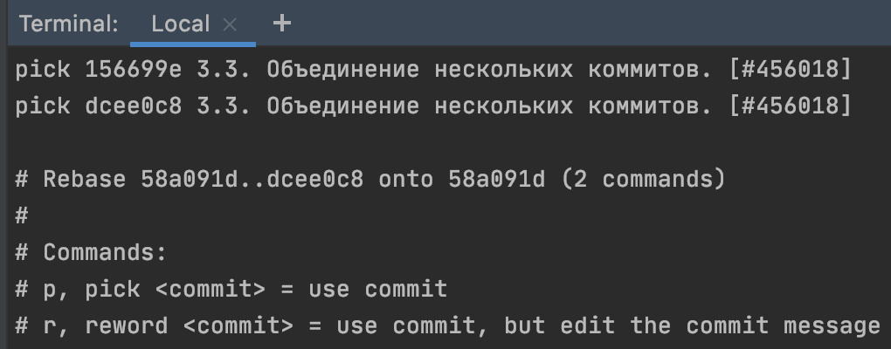

<h2>Работа с GIT</h2>
<ul>
    <li><a href="#branch">Ветки</a></li>
    <li><a href="#reset">Откат изменений</a></li>
    <li><a href="#rebase">Объединение нескольких коммитов</a></li>
    <li><a href="#stash">Откладывание кода</a></li>
</ul>
<h3><a name="branch">Ветки</a></h3>
<ul>
    <li><code> git branch </code> - команда позволяет посмотреть список веток в репозитории (ветка - это альтернативная линия разработки). Перед текущей веткой (в которой ведется разработка) будет стоять *</li>
    <li><code> git branch branch_name </code> - создание новой ветки</li>
    <li><code> git checkout branch_name </code> - переключаемся на новую ветку</li>
    <li><code>  git checkout -b branch_name </code> - создание новой ветки и переключение на нее</li>
    <li><code> git fetch </code> - выгрузка всех изменений из удаленного репозитория (VCS -> Git -> Fetch в IDEA)</li>
    <li><code> git branch -d branch_name </code> - удалить ветку</li>
    <li><code> git merge branch_name</code> - влить ветку branch_name в текущую</li>
    <!--<li><code>  </code> - </li>-->
</ul>
<h3><a name="reset">Откат изменений</a></h3>

Если нужно изменить историю зафиксированных изменений, то загрузку на github нужно сделать в режиме --force  <code> git push origin +master </code>

<ul>
    <li>
        <strong>git reset --soft</strong> 
        Возьмем для примера ветку: 
        - A - B - C (master) 
        HEAD указывает на C и индекс совпадает с C.  
        Если выполнить команду <code> git reset --soft B </code>  
        HEAD будет указывать на B и изменения из коммита C будут в индексе, как будто вы их добавили командой git add. Если вы сейчас выполните git commit вы получите коммит полностью идентичный C.
    </li>
    <li>
        <strong>git reset --mixed</strong> 
        Режим --mixed используется по умолчанию, т.е. <code> git reset --mixed = git reset </code> 
        Вернемся к тем же начальным условиям: 
        - A - B - C (master)  
        Выполнив <code> git reset --mixed B </code> или <code> git reset B </code> 
        HEAD опять же будет указывать на B, но на этот раз изменения из С не будут в индексе и если вы запустите здесь git commit ничего не произойдет т.к. ничего нет в индексе. У нас есть все изменения из С, но если запустить git status то вы увидите, что все изменения not staged. Чтобы их закоммитить нужно сначала добавить их в индекс командой git add и только после этого git commit.
    </li>
    <li>
        <strong>git reset --hard</strong> 
        Те же самые начальные условия: 
        - A - B - C (master) 
        Последний режим --hard также как и --mixed переместит HEAD на В и очистит индекс, но в отличие от --mixed жесткий reset изменит файлы в вашей рабочей директории. Если выполнить <code> git reset --hard B </code>  
        то изменения из С, равно как и незакоммиченные изменения, будут удалены и файлы в репозитории будут совпадать с B. Учитывая то, что этот режим подразумевает потерю изменений, вы всегда должны проверять git status перед тем как выполнить жесткий reset чтобы убедиться что нет незакоммиченных изменений(или они не нужны).
    </li>
</ul>
<h3><a name="rebase">Объединение нескольких коммитов.</a></h3>

    Для объединения двух последних коммитов нужно выполнить команду в терминале: 
    <code> git rebase -i HEAD~2 </code>  
    HEAD~2 указывает, что мы хотим рассмотреть 2 последний коммита. 
    HEAD - указывает на последний коммит 
    ~2 - сдвинуться на два коммита ниже. 
    После выполнения команды откроется текстовый редактор со списком коммитов 
     
    Они показываются в порядке сначала старые потом новые коммиты. 
    Рядом с номером коммита идет команда указывающая что нужно сделать с этим коммитом. 
    pick - значит использовать этот коммит в истории. 
    squash - позволяет слить изменения текущего коммита в предыдущий. 
    После сохранения файла снова откроется редактор с предлложением сохранить нужный текст коммита

<h3><a name="stash">Откладывание кода.</a></h3>

    Команда <code> git stash </code> сохраняет незафиксированные изменения (подготовленные и неподготовленные) в отдельном хранилище, чтобы вы могли вернуться к ним позже. Затем происходит откат до исходной рабочей копии по аналогии <code> git reset --hard HEAD </code>

    Рекомендуем добавлять к отложенным изменениям описание в качестве подсказки. Для этого используется команда <code> git stash save "сообщение" </code>

    Теперь вы можете вносить изменения, создавать новые коммиты, переключаться между ветками и выполнять другие операции Git. По необходимости отложенные изменения можно будет применить позже.
    Отложенные изменения сохраняются в локальном репозитории Git и не передаются на сервер при выполнении команды push.

    Чтобы применить ранее отложенные изменения, воспользуйтесь командой <code> git stash pop </code> При извлечении отложенных изменений они удаляются из набора и применяются к рабочей копии.

    Вы также можете применить изменения к рабочей копии без удаления из набора отложенных изменений. Для этого воспользуйтесь командой <code> git stash apply </code> Это полезно, если вам нужно применить одни и те же отложенные изменения к нескольким веткам.

    Команду <code> git stash </code> можно выполнить несколько раз, после чего у вас будет возможность просмотреть список наборов с помощью команды <code> git stash list </code>

